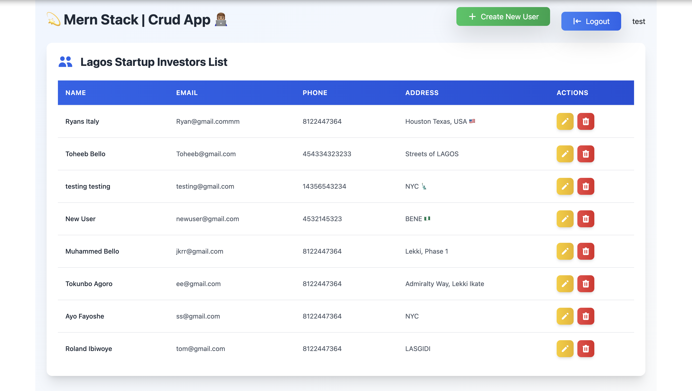

<div align="center">
  <h2 align="center">💫 Full-stack Crud Website | Mern Stack</h2>

 Create Read Undo Delete modern web application <br/> Built using MondoDB, Express.js, React.js, Node.js &amp; Tailwind CSS. <br/>

  <a href="https://crud-w3b.vercel.app"><strong>➥Live Demo</strong></a>

</div>

<br />

### Demo Screeshots



💫 MERN CRUD Web App with Authentication & Security
A full-stack web application built with the MERN stack (MongoDB, Express, React, Node.js). Features include:

▸ Secure user authentication with JWT and bcrypt.
▸ Full CRUD functionality for managing data.
▸ Responsive UI and RESTful API integration.

🚀 Perfect for learning or as a foundation for scalable projects.

### Prerequisites

Before you begin, ensure you have met the following requirements:

* [Git](https://git-scm.com/downloads "Download Git") must be installed on your operating system.

### Installing CRUD APP

To install **CRUD APP**, run this command on your git bash:

Linux and macOS:

```bash
sudo git clone https://github.com/rolandaayo/crud-app.git
```

Windows:

```bash
git clone https://github.com/rolandaayo/crud-app.git
```

## 💬 Contact

If you have an offer, opportunity, or introduction that might make my life more interesting, email me at ibiwoyeroland@gmail.com.

For the reasons stated above, I'll only respond to proposals that are matched for my schedule and interests.

### License

This project is **free to use** and does not contains any license.
